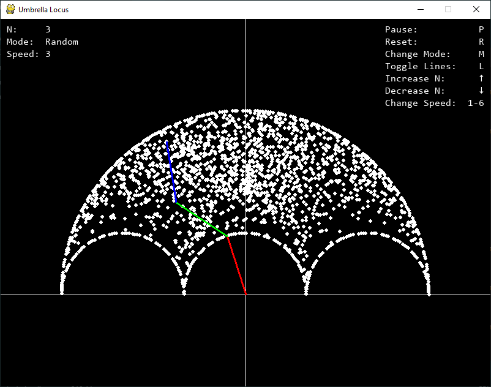

# Loci visualizer

A small app to visualize an interesting loci problem. Uses [PyGame](https://www.pygame.org/) for canvas and keyboard support.

## The problem

What is the set of all points that lie at the end of two equal line segments placed tip to tail if both line segments are restricted so that they cannot point below horizontal? What if more line segments are included?

## The visualizer

The 3 "umbrella_locus" scripts are included, but all functionality is captured in the final version loci_visualizer.py

